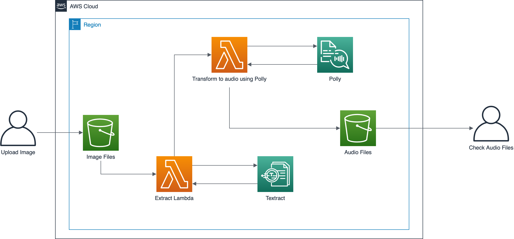
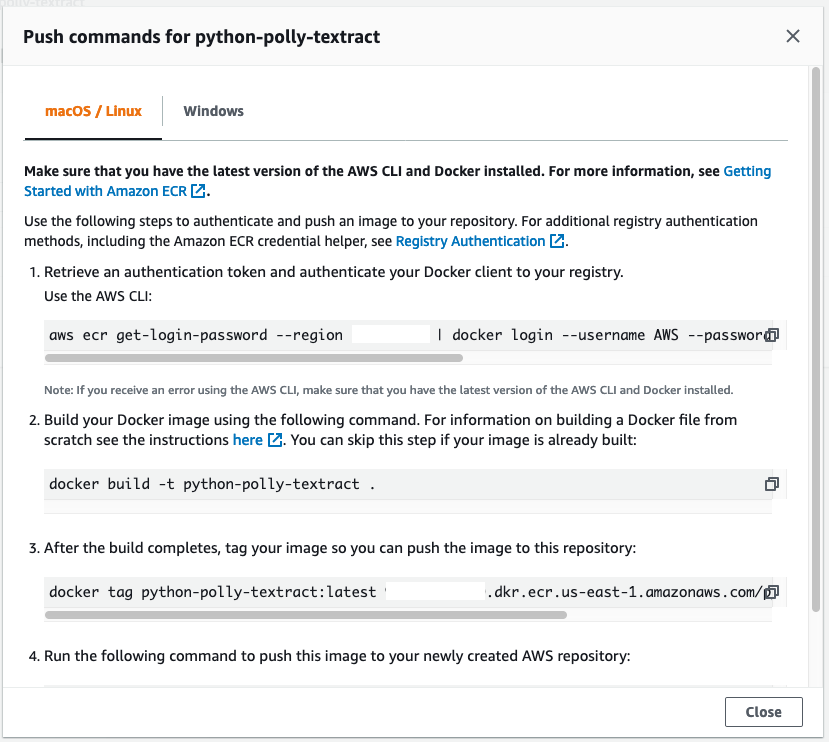
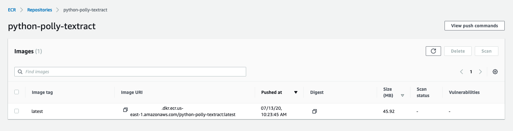
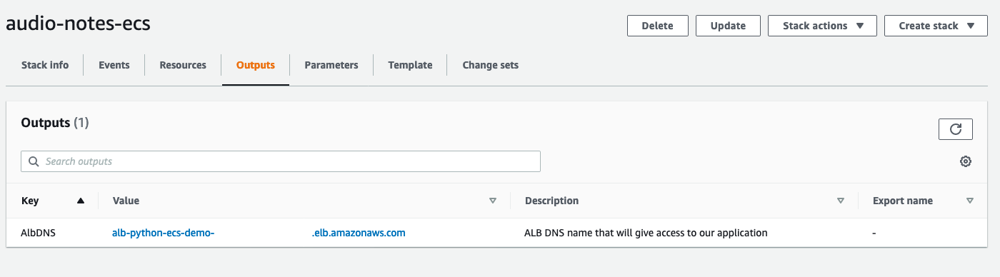
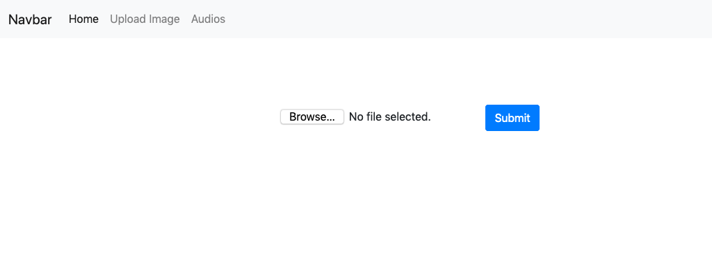
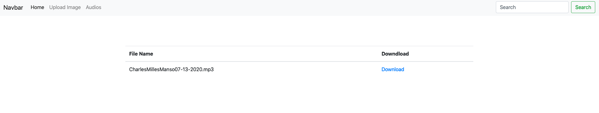

# audio-notes-demo

This is a demonstrantion of using [Amazon Textextract](https://aws.amazon.com/textract/) and [Amazon polly](https://aws.amazon.com/polly/) to extract text from images and generate audio files from it, allowing you to hear it later.

# Prerequisites:

- [Docker](https://docs.docker.com/get-docker/)
- [Docker Compose](https://docs.docker.com/compose/install/) - Only to run web app locally
- [awscli](https://docs.aws.amazon.com/cli/latest/userguide/cli-chap-install.html)
- [Pre configured AWS credentials](https://docs.aws.amazon.com/amazonswf/latest/awsrbflowguide/set-up-creds.html)
- [Pre configured VPC with minimun of 2 public subnets]()

# The Architecture:

<p align="center"> 

</p>

# Provisioning the infrastructure:

First you need to create a S3 bucket to store our application lambda code. (That will be used in CloudFormation Later)

**Note:** Replace <MY_BUCKET_NAME> to a bucket name that you are going to use. (Take note of the choosen bucket name)

```shell
aws s3 mb s3://<MY_BUCKET_NAME>
```

ZIPing (compressing) the lambda code.

```shell
cd lambda_textract/ && zip ../lambda_textract.zip lambda_function.py
```

```shell
cd ../lambda_polly && zip ../lambda_polly.zip lambda_function.py
```

```shell
cd ../
```

Uploading the lambda packages to the S3 bucket that we have created in the prior step.

```shell
aws s3 cp lambda_textract.zip s3://<MY_BUCKET_NAME>/lambda/
```

```shell
aws s3 cp lambda_polly.zip s3://<MY_BUCKET_NAME>/lambda/
```

**Now we need to create two stacks using the CloudFormation template, available in ./cloudFormation/ folder**

# The Lambda Stack:

This CloudFormation template will provision all the components to extract the text from the image files using Textract, publishing it into the S3 bucket to be converted in audio using Polly.

- Run the follow command to provision the first structure to the demo: (Replace all the command line parameters by the proper values) **<>**

```shell
aws cloudformation create-stack --stack-name audio-notes-stack --template-body file://cloudformation/audionotesstack.yaml --parameters ParameterKey=BucketName,ParameterValue=<NEW_BUCKET_NAME> ParameterKey=BucketLambdaCode,ParameterValue=<BUCKET_NAME_THAT_WE_PROVISIONED_BEFORE> --capabilities CAPABILITY_IAM
```

- After the provisioning, sign-in to the AWS console, and search for **Cloudformation** in the **Services** tab.

- Search for **audio-notes-stack** and click on it, go to the **Outputs** tab and get the **BucketName** and the **ECRRepositoryArn**. These info will be needed in the next steps.

<p align="center"> 

</p>

# The ECS Stack:

Before we create the ECS cluster stack, we need to create and push the Docker image of the web application to the ECR Repository that we have created before.

- In the AWS console, search for **ECR** in **Services** tab.

- Search for the ECR repository that we created with the stack before (the name would be **python-polly-textract**), and click on it.

- Click on **View push commands**.

- Go to **web_app/** and follow the instructions below, that will push to ECR a Docker image with a tag **latest**:

<p align="center"> 

</p>

- The result should sound like this:

<p align="center"> 

</p>

- Copy the Image URI. We will use it later on in the demo.

## Provisioning the ECS Cluster:

The CloudFormation template below will provision an ECS cluster to host the Web Application, that we will use to upload the images to the S3 bucket, and later download the generated audio files from the S3.

```shell
aws cloudformation create-stack --stack-name audio-notes-ecs --template-body file://cloudformation/ecsstack.yaml --parameters ParameterKey=ServiceName,ParameterValue=<SERVICE_NAME> ParameterKey=ImageUrl,ParameterValue=<ECR_IMAGE_URL> ParameterKey=BucketName,ParameterValue=<BUCKET_CREATED_ABOVE_BY_CF> ParameterKey=VpcId,ParameterValue=<ID_OF_VPC_TO_PROVISION_OUR_CLUSTER> ParameterKey=VpcCidr,ParameterValue=<CIDR_OF_THE_VPC> ParameterKey=PubSubnet1Id,ParameterValue=<ID_OF_THE_FIRST_PUB_SUB> ParameterKey=PubSubnet2Id,ParameterValue=<ID_OF_THE_SECOND_PUB_SUB> --capabilities CAPABILITY_IAM
```

This is an example on how the command above should looks like:

```shell
aws cloudformation create-stack --stack-name audio-notes-ecs --template-body file://cloudformation/ecsstack.yaml --parameters ParameterKey=ServiceName,ParameterValue=python-service ParameterKey=ImageUrl,ParameterValue=xxxxxxx.dkr.ecr.XXXX.amazonaws.com/python-polly-textract:latest ParameterKey=BucketName,ParameterValue=textract-polly-demo-aapds ParameterKey=VpcId,ParameterValue=vpc-xxxxxxxxxx ParameterKey=VpcCidr,ParameterValue=X.X.X.X/X ParameterKey=PubSubnet1Id,ParameterValue=subnet-xxxxxxxx ParameterKey=PubSubnet2Id,ParameterValue=subnet-xxxxxxxx --capabilities CAPABILITY_IAM
```

- Go to the AWS console and follow this option path: **Services>CloudFormation>audio-notes-ecs>Outputs**, get the Load Balancer DNS name to access the application in the browser.

<p align="center"> 

</p>

# How the application works:

Access the DNS address of the ELB, provisioned by our CloudFormation stack.

- Go to the "Upload Image" option in the App menu.

<p align="center"> 

</p>

- Select an Image you would like to Upload. This action will trigger the process of the Architecture Diagram above and convert the image text in an audio file.

- You will see the generated audio file, and you will be able to Download and listen it.

<p align="center"> 

</p>

# Cleaning up:

- Delete all the files inside of the provisioned S3 bucket.

```shell
aws s3 rm s3://<BUCKET_NAME_THAT_WAS_PROVISIONED_BY_CF> --recursive
```

- Delete the container image, inside the ECR Repository.

- Delete the CloudFormation stacks.

```shell
aws cloudformation delete-stack --stack-name audio-notes-stack
```

```shell
aws cloudformation delete-stack --stack-name audio-notes-ecs
```

- Delete the S3 bucket that we used to store the lambda codes.

```shell
aws s3 rb s3://<MY_BUCKET_NAME> --force
```